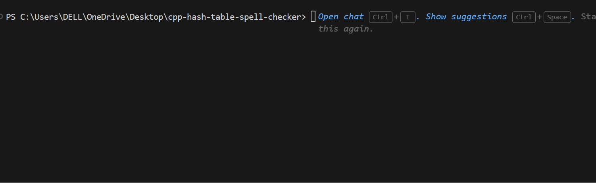

# C++ Hash Table Spell Checker


---

A command-line **spell checker implemented in C++** using a **hash table with separate chaining**.

The program loads words from a dictionary, checks whether user-entered words exist in the dictionary, and suggests similar words when a spelling mistake is detected.  
This project demonstrates hashing, linked lists, file I/O, and simple string-similarity logic.

---

## Table of contents

- [Features](#features)  
- [Project structure](#project-structure)  
- [How it works](#how-it-works)  
- [Compile & Run](#compile--run)  
- [Demo](#demo)  
- [Key Functions and Data Structures](#key-functions-and-data-structures)  
- [Author](#author)

---

## Features

- Fast dictionary lookup using a **hash table**  
- **Separate chaining** (linked lists) to handle collisions  
- Case-insensitive word checking  
- Simple **word suggestion** system for misspelled words  
- Loads dictionary from a text file (`dictionary.txt`)  
- Manual memory cleanup (`unload()`)

---

## Project structure
cpp-hash-table-spell-checker
```
├── main.cpp # Program entry point
├── dictionary.cpp # Dictionary loading, lookup, suggestions
├── dictionary.h # Structures & function declarations
├── dictionary.txt # Word list used as dictionary
├── sample_input.txt # Example input for testing
└── README.md
```

---

## How it works

1. `load("dictionary.txt")` reads words one-by-one and inserts them into the hash table.  
2. `hashWord()` (djb2) computes an index: `index = hash % N`.  
3. Each bucket is a linked list (separate chaining) — new words are inserted at the head.  
4. When a user types a word, `check()` lowercases and searches the linked list at the hashed index.  
5. If not found, `suggest()` scans nearby buckets (or whole table) and prints similar words found by `isSimilar()`.

---

## Compile & Run

Compile:

```
g++ main.cpp dictionary.cpp -o speller
```
Run:
```
./speller
```
---

## Demo


---

---

## Key Functions and Data Structures

This project demonstrates the use of fundamental **data structures and algorithms**, including **hash tables, linked lists, collision handling, and efficient word lookup**.

---

### 1. Hashing

- The program uses a **hash function (djb2)** to convert each word into an index in the hash table.
- This allows fast lookup of dictionary words in approximately **O(1)** average time.
- Each word is processed character by character to compute a hash value, which is then mapped to a bucket in the table.

**Function responsible:**

```
hashWord()
```

---

### 2. Linked Lists (Collision Handling)

- Since multiple words may produce the same hash index, **separate chaining** is used to handle collisions.
- Each bucket in the hash table stores a **linked list of nodes**, where each node represents a dictionary word.
- This structure allows efficient insertion and traversal when multiple words map to the same index.

**Used in:**

```
load()
check()
unload()
```

---

### 3. Dictionary Loading

- The dictionary file is read **word by word**.
- Each word is inserted into the appropriate bucket of the hash table based on the hash value.
- A new node is dynamically created for every word.

**Function responsible:**

```
load()
```

---

### 4. Spell Checking

- When a user enters a word, the program calculates its **hash value**.
- It then traverses the linked list at that index to check whether the word exists in the dictionary.

**Function responsible:**

```
check()
```

---

### 5. Word Suggestions

- If a word is not found, the program searches for **similar words** in the dictionary.
- A simple similarity rule is used:
  - Length difference ≤ 1
  - Maximum one character mismatch
- The program prints **up to three suggestions**.

**Functions responsible:**

```
isSimilar()
suggest()
```

---

### 6. Memory Management

- All dynamically allocated nodes in the hash table are freed before the program exits.
- This prevents **memory leaks**.

**Function responsible:**

```
unload()
```

---

---

## Author

Jaanvi Vohra
